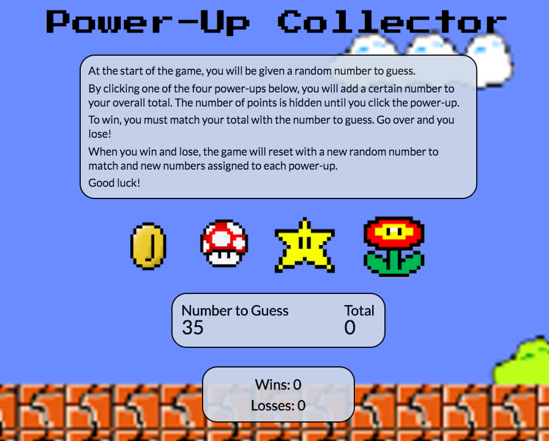

# week-4-game

A Mario-themed power-up collector game. Built with HTML, CSS, Google Fonts, JavaScript, and jQuery.

https://raevaughan.github.io/week-4-game/

***

At the start of the game, the user is given a random number, and each power-up is assigned a number that is unknown to the player. The player must click the different power-ups to gain points. The goal is to match points gained from power-ups to the number to guess.

